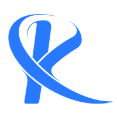

 <h1>Interduction</h1>
 
This project was developed for an SMART-BASKET that gets on very well with artificial intelligence. 

 
in this project the font-end of this software was developed by ME.

 
I went through with the back-end in this project.

  
 <h1>Built With</h1>
 
in this project so many freamworks and libraries were used the crusial of theme are in this list, LET ME SHOW YOU 8-)
     for inctance:
 

  
 <ul>
     <li><li>
     <li><li>
     <li></li>
 </ul>
  
  
 <h1>Contact</h1>
 <a style=" display: block; text-decoration: none; margin: 1px  auto;" href="tel:+98 903 803 7175">+98 903 803 7175</a>  
 <a style=" display: block; text-decoration: none; margin: 1px  auto;" href="mailto:Ali.mirhamed79@gmail.com">Ali.mirhamed79@gmailcom</a>

